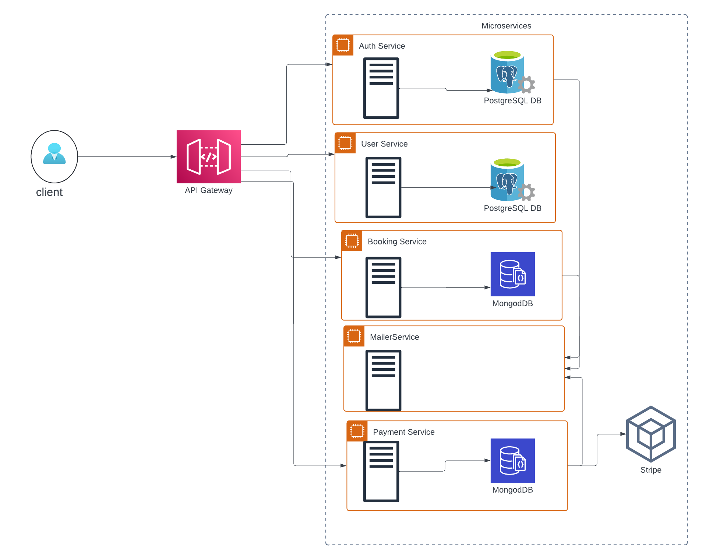

# Travel Booking Microservices

This repository demonstrates a microservices architecture using **NestJS**. The project consists of several distinct services, each serving a specific purpose. Let's dive into the details:

## Services

1. **auth-service**: Responsible for authentication and user management.
2. **user-service**: Handles user-related operations.
3. **booking-service**: Manages booking-related functionality.
4. **mailer-service**: Sends email notifications.
5. **payment-service**: Integrates with Stripe for payment processing.

## Features

- **Authentication Service:**

  - **User Signup:** Customers can create new accounts by providing their personal details.
  - **User Signin:** Registered customers can sign in to access their accounts.
  - **Password Management:** Customers can reset and update their passwords securely.
  - **User Session Management:** Maintains user sessions and ensures secure access to protected resources.

- **Booking Service:**

  - **Ticket Booking:** Enables users to book travel tickets.
  - **Ticket Cancellation:** Allows users to cancel their booked tickets.
  - **Ticket Update:** Allows users to update their booked tickets.

## Other Features

### RabbitMQ Communication

I use **RabbitMQ** as our message broker for communication between services. It ensures reliable and asynchronous communication.

### Different Databases

- **User Service** and **Auth Service** use **PostgreSQL** for storing user data.
- **Booking Service** and **Payment Service** utilize **MongoDB** for booking and payment-related data.

### CQRS Implementation

I've implemented the **Command Query Responsibility Segregation (CQRS)** pattern in the **Booking Service** and **Payment Service**. This separation of read and write operations enhances scalability and maintainability.

### OAuth2 with JWT

- **OAuth2** is used for authentication and authorization.
- **JSON Web Tokens (JWT)** are issued upon successful authentication, allowing secure communication between services.

### Stripe Integration

I've integrated **Stripe** as our payment service provider. It handles payment processing securely.

### Redis Caching

For quick data retrieval, we've implemented **Redis caching**. Cached data improves response times and reduces load on databases.

### Dockerization

Each service is containerized using **Docker**, ensuring consistent deployment across environments.

### Husky for Development

I've set up **Husky** to streamline development workflows. It enforces code quality checks and runs tests before commits.

### Getting Started

To get started with the Travel Booking System, follow the instructions provided in the Docs folder files for each service:

- Auth Service: [Readme](https://github.com/Femtech-web/Travel-Booking-Microservice/tree/main/docs/auth-service.md)
- User Service: [Readme](https://github.com/Femtech-web/Travel-Booking-Microservice/tree/main/docs/user-service.md)
- Booking Service: [Readme](https://github.com/Femtech-web/Travel-Booking-Microservice/tree/main/docs/booking-service.md)
- Payment Service: [Readme](https://github.com/Femtech-web/Travel-Booking-Microservice/tree/main/microservices/payment-service.md)

### Technologies Used

- Typescript
- Node.js
- Nest.js
- MongoDB (TypeORM)
- PostgreSQL (prisma)
- RabbitMQ (Message Queue)
- JSON Web Tokens (JWT)
- bcrypt.js
- Nodemailer (for the Notification Service)

## Getting Started

1. Clone this repository.
2. Install dependencies for each service.
3. Configure environment variables (e.g., database connections, RabbitMQ settings).
4. Run services using `npm run start:service-name`.
